<h1>👋 &nbsp;Olá, Eu sou Evandro Tomas, Sou um entusiasta de tecnologia, impulsionado pela curiosidade e pela vontade de criar soluções inteligentes. Busco evoluir continuamente minhas habilidades e participar de projetos que gerem impacto real. </h1>

<h2> 👨🏻‍💻 &nbsp;About Me </h2>

Sou um desenvolvedor em início de carreira, movido pela curiosidade e pelo aprendizado contínuo. Estou sempre estudando novas tecnologias e aprimorando minhas habilidades por meio de projetos práticos e desafios reais.

- 🌱 Sempre estudando e explorando novas ferramentas e linguagens.
- 🧩 Interesse em desenvolvimento web, interfaces modernas e soluções escaláveis.
- 🛠️ Já desenvolvi projetos de relevância, que demonstram minha capacidade de evoluir e aplicar conceitos na prática.
- 🎯 Focado em crescer como profissional e contribuir cada vez mais com soluções úteis.

<h2>📂 Meus projetos</h2>

Aqui no meu GitHub você encontrará projetos que representam minha evolução e meu esforço contínuo. Entre eles:

- Aplicações web completas
- APIs desenvolvidas do zero
- Interfaces modernas e responsivas
- Projetos experimentais para estudo de novas tecnologias

<h2>🎯 Objetivos Atuais</h2>

- Aprimorar continuamente minhas competências em desenvolvimento web.
- Desenvolver projetos cada vez mais completos, escaláveis e bem estruturados.
- Atuar de forma ativa na comunidade, contribuindo e colaborando com projetos.
- Conquistar uma oportunidade profissional como desenvolvedor.

<h2> 🛠 &nbsp;Tecnologias que estudo e utilizo</h2>

<h3>👨‍💻 &nbsp;Linguagens:</h3>

<h3>💻  &nbsp;Front-end:</h3>

<h3>⚙️ &nbsp;Back-end</h3>

<h3>🛢 &nbsp;Banco de Dados:</h3>

<h3>🛠️ &nbsp;Ferramentas:</h3>

<h2> 📫 &nbsp;Como falar comigo</h2>

  

<h2>🚀 &nbsp;My GitHub Stats</h2>

